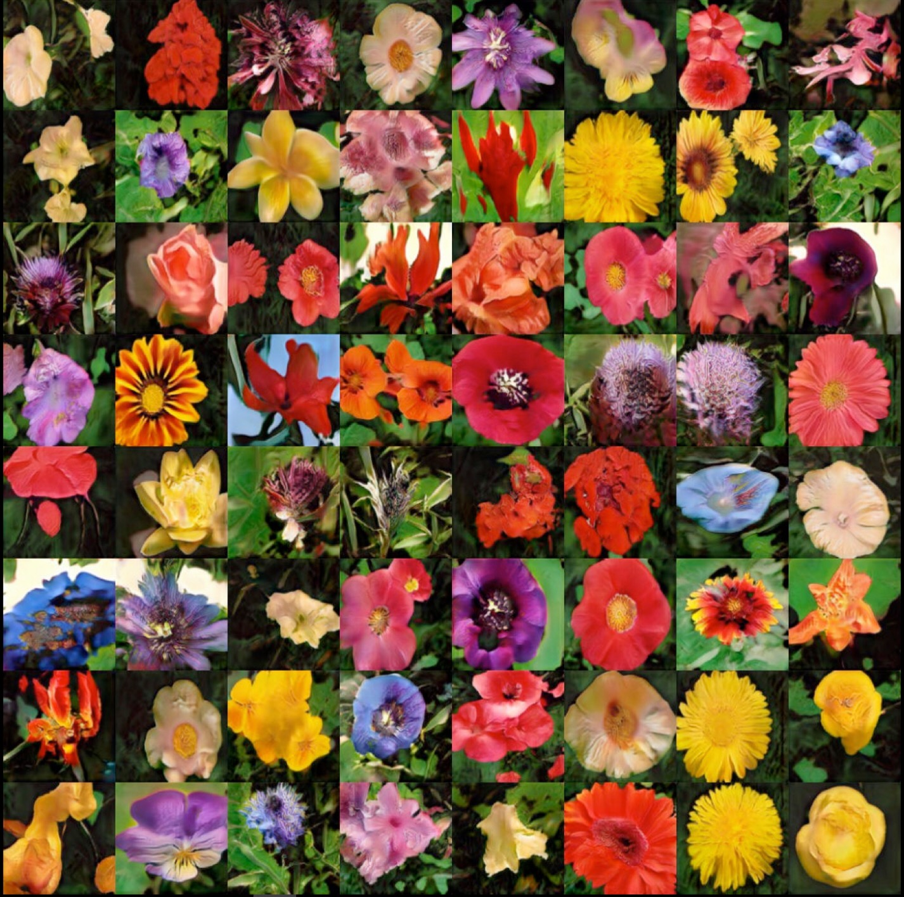

# Text to Image Synthesis using Generative Adversarial Networks

This is the official code for [Text to Image Synthesis using Generative Adversarial Networks](https://arxiv.org/abs/1805.00676).
Please be aware that the code is in an experimental stage and it might require some small tweaks.

If you find my research useful, please use the following to cite:
```
@article{Bodnar2018TextTI,
  title={Text to Image Synthesis Using Generative Adversarial Networks},
  author={Cristian Bodnar},
  journal={CoRR},
  year={2018},
  volume={abs/1805.00676}
}
```


## Images generated by the Conditional Wasserstein GAN

As it can be seen, the generated images do not suffer from mode collapse.



Illustration of Conditional Wasserstein Progressive Growing GAN on the flowers dataset:


Samples from the birds dataset


## How to download the dataset

1. Setup your `PYTHONPATH` to point to the root directory of the project.
2. Download the preprocessed [flowers text descriptions](https://drive.google.com/file/d/0B3y_msrWZaXLaUc0UXpmcnhaVmM/view) 
and extract them in the `/data` directory.
3. Download the [images from Oxford102](http://www.robots.ox.ac.uk/~vgg/data/flowers/102/102flowers.tgz) 
and extract the images in `/data/flowers/jpg`. You can alternatively run `python preprocess/download_flowers_dataset.py` from the 
root directory of the project.
4. Run the `python preprocess/preprocess_flowers.py` script from the root directory of the project.

### Requirements

- python 3.6
- tensorflow 1.4
- scipy
- numpy
- pillow
- easydict
- imageio
- pyyaml

