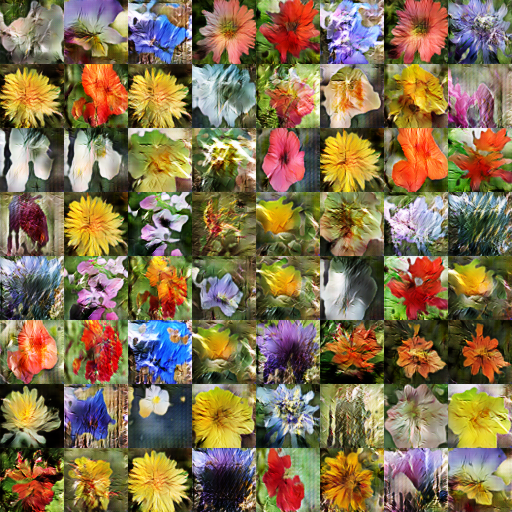

# GANCLS in Tensorflow

Tensorflow implementation of [GAN-CLS for Generative Adversarial Text to Image Synthesis](https://arxiv.org/abs/1605.05396)
using a pre-trained Char-CNN-RNN encoder.

My own implementation of the CNN-RNN encoder will be released in the next few 
months.

### Instructions

Make sure your PYTHONAPTH is pointing to the root directory of the project. For instructions on setting up the
dataset, check the main README.

To run the program run the following instruction from the root directory of the project: `python --cfg [path_to_config]`.
'cfg', './models/gancls/cfg/flowers.yml'. If the `--cfg` flag is not specified, then the default config 
from `./models/gancls/cfg/flowers.yml` will be used. You can switch between training and testing 
by setting TRAIN.FLAG to either true or false in the config.

